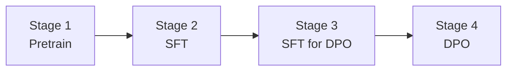

# vocab_32k_gpt2_moe

A from-scratch training stack for a **GPT-2 style Mixture-of-Experts language model** with a 32K SentencePiece
vocabulary, covering the full alignment pipeline: pretraining, supervised fine-tuning, and Direct Preference
Optimization.

<p>
  
  
  
  
</p>

The model is a plain GPT-2 decoder in which the feed-forward block of each layer is replaced by a top-k routed
mixture of experts, so a large parameter budget is trained while only a fraction of it is activated per token.
Everything runs on `accelerate` + DeepSpeed with bf16 mixed precision, streaming datasets, and step-level
checkpoint resumption.

---

## Contents

- [Pipeline](#pipeline)
- [Highlights](#highlights)
- [Model architecture](#model-architecture)
- [Installation](#installation)
- [Repository layout](#repository-layout)
- [Quickstart](#quickstart)
- [Data formats](#data-formats)
- [Configuration reference](#configuration-reference)
- [Distributed training](#distributed-training)
- [Checkpointing and resumption](#checkpointing-and-resumption)
- [Logging](#logging)
- [Evaluation](#evaluation)
- [Reproducibility](#reproducibility)
- [Notes and rough edges](#notes-and-rough-edges)
- [Acknowledgements](#acknowledgements)

---

## Pipeline



| Stage | Script | Config | Entry point | Output |
| --- | --- | --- | --- | --- |
| 1. Pretrain | `scripts/launch/pre_train_moe.sh` | `configs/pretrain_config.yaml` | `train.py` | `ckpt/vocab_32k_gpt2_moe` |
| 2. SFT | `scripts/launch/sft.sh` | `configs/instruct_config.yaml` | `train.py` | `ckpt/vocab_32k_gpt2_moe_instruction` |
| 3. SFT for DPO | `scripts/launch/sft4dpo.sh` | `configs/dpo_instruct_config.yaml` | `train.py` | `ckpt/vocab_32k_gpt2_moe_sft4dpo` |
| 4. DPO | `scripts/launch/dpo.sh` | CLI flags on `dpo.py` | `dpo.py` | `ckpt/vocab_32k_gpt2_moe_dpo` |

Stage 3 is a short supervised pass over the *prompt distribution used by the preference data*. It keeps the policy
and the preference pairs in the same domain, which makes DPO markedly more stable.

## Highlights

- **Sparse MoE feed-forward blocks** with top-k routing, optional always-active shared experts, and a
  load-balancing auxiliary loss that can be computed per sequence or per batch.
- **One training entry point** (`train.py` + `trainer.py`) shared by pretraining and SFT; the stage is selected
  purely by config (`data.mode`).
- **Custom tokenizer contract**: `Vocab32kGPT2Tokenizer` reads `bos`/`eos`/`unk`/`pad` ids straight out of the
  SentencePiece model, so the tokenizer and the model config can never drift apart.
- **Streaming data pipeline** with document packing, prompt masking for SFT, and per-rank sharding, so corpora
  larger than local disk never need to be materialized.
- **Exact resumption**: optimizer, scheduler and RNG state are restored via `accelerator.load_state`, and the
  dataloader fast-forwards past batches that were already consumed.
- **Flash-Attention 2** support, selected through the standard `_attn_implementation` config switch.
- **LoRA** and gradient checkpointing available as one-line config flags.

## Model architecture

Defaults from `configs/model_configs/vocab_32k_gpt2_moe.json`:

| Component | Value |
| --- | --- |
| Layers (`n_layer`) | 12 |
| Hidden size (`n_embd`) | 768 |
| Attention heads (`n_head`) | 12 |
| Context length (`n_positions`) | 1024 |
| FFN inner size (`n_inner`) | 3072 (`4 x n_embd`) |
| Vocabulary | 32,000 (SentencePiece unigram) |
| Routed experts (`n_routed_experts`) | 8 |
| Experts per token (`num_experts_per_tok`) | 2 |
| Shared experts (`n_shared_experts`) | disabled |
| MoE layer frequency (`moe_layer_freq`) | 1 (every layer) |
| Dense layers before MoE (`first_k_dense_replace`) | 0 |
| Total parameters | ~507M |
| Activated parameters per token | ~167M |
| Token ids | `bos=1`, `eos=2`, `pad=3` |

Input embeddings and the LM head are tied, and `c_proj` weights use the GPT-2 residual-scaled initialization
(`std = initializer_range / sqrt(2 * n_layer)`).

Public classes, exported from `models/`:

| Class | Role |
| --- | --- |
| `Vocab32kGPT2MoeConfig` | Configuration, including all MoE options |
| `Vocab32kGPT2MoeModel` | Bare decoder stack |
| `Vocab32kGPT2MoeForCausalLM` | Decoder plus tied LM head |
| `Vocab32kGPT2MoeDecoderLayer` | One decoder layer (attention + dense or MoE FFN) |
| `Vocab32kGPT2SparseMoeBlock` | Routed MoE feed-forward block |
| `MoEGate` | Top-k router and auxiliary load-balancing loss |
| `Vocab32kGPT2Tokenizer` | SentencePiece tokenizer |

The previous snake_case names (`vocab_32k_GPT2MOELMHeadModel`, `vocab_32k_gpt2moeConfig`,
`vocab_32k_gpt2Tokenizer`, ...) remain available as deprecated aliases, so existing scripts and checkpoints keep
working.

### Routing

`MoEGate` scores tokens against an `n_routed_experts x hidden_size` weight matrix, softmaxes the logits, and keeps
the top `num_experts_per_tok` experts. With `norm_topk_prob=True` the surviving weights are renormalized to sum to
one. During training, an auxiliary loss pushes the router towards a uniform expert load and is attached to the
graph through `AddAuxiliaryLoss`, so it contributes gradients without polluting the reported loss value.
Inference takes a separate path (`Vocab32kGPT2SparseMoeBlock.moe_infer`) that sorts tokens by expert and runs each
expert exactly once over its slice.

## Installation

Recommended environment:

- Python 3.10+
- CUDA 11.8+ matching your PyTorch build
- Linux or WSL2 (the launch scripts are bash)

```bash
git clone <this-repo> && cd vocab_32k_gpt2_moe
pip install -r requirements.txt
```

Flash-Attention 2 is optional and installed separately; the model falls back to the eager attention path when it
is missing:

```bash
pip install flash-attn --no-build-isolation
```

## Repository layout

```text
.
├── train.py                              # Pretrain / SFT entry point (absl flags)
├── trainer.py                            # Training loop, logging, checkpointing
├── dpo.py                                # DPO training via trl.DPOTrainer
├── requirements.txt
├── configs/
│   ├── pretrain_config.yaml               # Stage 1
│   ├── instruct_config.yaml               # Stage 2
│   ├── dpo_instruct_config.yaml           # Stage 3
│   ├── default_config.yaml                # Fallback accelerate config
│   ├── accelerate_configs/                # DeepSpeed ZeRO 1 / 2 / 3 / 3+offload
│   ├── model_configs/
│   │   └── vocab_32k_gpt2_moe.json         # Architecture definition
│   └── tokenizer_models/
│       ├── vocab_32k_gpt2_moe.model        # SentencePiece model
│       └── vocab_32k_gpt2_moe.vocab
├── dataset/
│   ├── dataset.py                          # Streaming pipeline for both modes
│   ├── data_iter.py                        # Standalone shard-aware JSONL iterator
│   └── validation.py                       # Fixed qualitative prompt suites
├── models/
│   ├── configuration_vocab_32k_gpt2_moe.py
│   ├── modeling_vocab_32k_gpt2_moe.py
│   └── tokenization_vocab_32k_gpt2.py
├── scripts/
│   ├── launch/                             # One script per pipeline stage
│   └── eval/                               # Generation smoke tests
└── logs/                                   # Archived training logs
```

## Quickstart

All commands are run from the repository root, since every config path is relative to it.

### Stage 1 - Pretrain

```bash
bash scripts/launch/pre_train_moe.sh
```

Equivalent to:

```bash
CUDA_VISIBLE_DEVICES=0,1,4,5,6,7 \
accelerate launch \
  --config_file configs/accelerate_configs/ds_stage2.yaml \
  train.py \
  --train_config configs/pretrain_config.yaml \
  --model_config configs/model_configs/vocab_32k_gpt2_moe.json
```

Leaving `train.ckpt` empty in the config starts from random weights; setting it resumes from existing weights.

### Stage 2 - Supervised fine-tuning

```bash
bash scripts/launch/sft.sh
```

Loads `ckpt/vocab_32k_gpt2_moe/` and writes to `ckpt/vocab_32k_gpt2_moe_instruction`. In `instruct` mode the
prompt tokens are masked out of the labels, so the loss is computed on responses only.

### Stage 3 - SFT on the DPO prompt distribution

```bash
bash scripts/launch/sft4dpo.sh
```

Continues from `ckpt/vocab_32k_gpt2_moe_instruction/checkpoint_epoch4` and writes to
`ckpt/vocab_32k_gpt2_moe_sft4dpo`.

### Stage 4 - Direct Preference Optimization

```bash
bash scripts/launch/dpo.sh
```

Equivalent to:

```bash
CUDA_VISIBLE_DEVICES=2,3,4,5,6,7 \
accelerate launch \
  --config_file configs/accelerate_configs/ds_stage2.yaml \
  dpo.py
```

`dpo.py` is configured with command-line flags rather than YAML. Frequently used ones:

| Flag | Default | Meaning |
| --- | --- | --- |
| `--model_name_or_path` | `ckpt/vocab_32k_gpt2_moe_sft4dpo/checkpoint_epoch6` | Stage-3 checkpoint DPO starts from |
| `--beta` | `0.1` | Strength of the KL constraint in the DPO loss |
| `--learning_rate` | `5e-4` | Peak learning rate |
| `--max_steps` | `50000` | Total optimizer steps |
| `--max_length` / `--max_prompt_length` | `1024` / `512` | Truncation budgets |
| `--per_device_train_batch_size` | `4` | Batch size per GPU |
| `--gradient_accumulation_steps` | `5` | Accumulation steps |
| `--output_dir` | `./ckpt/vocab_32k_gpt2_moe_dpo/` | Where checkpoints land |
| `--sanity_check` | `False` | Train on 1000 samples for a quick end-to-end run |

## Data formats

Every stage reads newline-delimited JSON. Paths are glob patterns, so sharded corpora work as-is.

### Pretraining (`data.mode: pretrain`)

One field is required:

```json
{"text": "Raw document text used for next-token prediction."}
```

With `concat_multiple_sequence: true`, `num_sequences` documents are tokenized, concatenated and re-chunked into
`seq_length` blocks, which removes almost all padding waste. `sequence_sample_mode` controls how oversized
documents are handled:

| Mode | Behaviour |
| --- | --- |
| `truncation` | Truncate to `seq_length` at tokenization time |
| `none` | Keep the full token stream (use together with packing) |
| `sample` | Sample a random `seq_length` window, biased towards the document start |
| `split` | Emit every non-overlapping `seq_length` window as a separate example |

### Instruction tuning (`data.mode: instruct`)

```json
{"instruction": "Introduce yourself.", "input": "", "output": "I am a language model...", "history": []}
```

- `instruction` and `output` are required; `input` may be an empty string and `history` an empty list.
- `history` holds `[user, assistant]` turn pairs. Multi-turn records are expanded into one training example per
  turn, each masked so that only the assistant response contributes to the loss.

Rendered templates:

```text
### Instruction:
{instruction}

### System:
{output}</s>
```

```text
### Instruction:
{instruction}

### Input:
{input}

### System:
{output}</s>
```

### Preference data (DPO)

`dpo.py` reads `data/DPO/mix_dpo_data.jsonl`:

```json
{"question": "How should I start learning deep learning?", "response_j": "Start with linear algebra and Python...", "response_k": "No idea."}
```

`response_j` is the preferred continuation, `response_k` the rejected one. Prompts are rendered with the same
instruction template as SFT before being handed to `DPOTrainer`.

## Configuration reference

### Training config (`configs/*.yaml`)

**`data` section**

| Key | Meaning |
| --- | --- |
| `mode` | `pretrain` or `instruct` |
| `data` | Mapping of dataset name to JSONL glob pattern |
| `seq_length` | Tokens per training example |
| `pad_to_max` | Pad every example to `seq_length` (required for SFT masking) |
| `sequence_sample_mode` | `truncation`, `none`, `sample` or `split` |
| `concat_multiple_sequence` | Pack several documents into one example |
| `num_sequences` | Documents per packing window |
| `tokenizer_model_path` | Path to the SentencePiece model |
| `split_by_shard` | Shard files across ranks instead of skipping records |

**`train` section**

| Key | Meaning |
| --- | --- |
| `train_batch_size` | Batch size **per process** |
| `gradient_accumulation_steps` | Must match the value in the accelerate config |
| `num_training_steps` | Total data steps; also the horizon of the cosine schedule |
| `num_warmup_steps` | Linear warmup length |
| `lr`, `weight_decay` | FusedAdam hyperparameters, `betas=(0.9, 0.95)` |
| `ckpt` | Weights to initialize from; empty means random init |
| `train_num_workers_4_dataloader`, `prefetch_factor` | Dataloader throughput knobs |
| `train_and_eval` | Sample from `val_set_pretrain` during training |
| `gradient_checkpointing_enable` | Trade compute for activation memory |
| `use_lora` | Wrap the model with a LoRA adapter (`r=1`, `alpha=32`) |

**Top level**

| Key | Meaning |
| --- | --- |
| `log_interval`, `eval_interval`, `save_interval` | Cadence in global steps |
| `work_dir` | Checkpoint root, also where resumption looks |
| `project_name` | Weights & Biases project |

Parameters with `bias`, `LayerNorm.weight` or `layernorm.weight` in their name are excluded from weight decay.

### Model config (`configs/model_configs/*.json`)

Any field of `Vocab32kGPT2MoeConfig` can be set here. Setting `n_routed_experts: null` turns every layer dense and
reduces the model to plain GPT-2, which is a useful ablation baseline. See the class docstring for the full list,
including `aux_loss_alpha`, `seq_aux`, `norm_topk_prob` and `scoring_func`.

`vocab_size` and `pad_token_id` are overwritten at runtime from the tokenizer, so the JSON can never disagree with
the SentencePiece model.

## Distributed training

`configs/accelerate_configs/` ships four bf16 DeepSpeed presets:

| Config | ZeRO stage | Offload | Use when |
| --- | --- | --- | --- |
| `ds_stage1.yaml` | 1 | none | Fastest; model and optimizer fit comfortably |
| `ds_stage2.yaml` | 2 | none | Default for every launch script |
| `ds_stage3.yaml` | 3 | none | Parameter sharding needed |
| `ds_stage3_offload.yaml` | 3 | CPU params + optimizer | Last resort when memory is tight |

Two values must agree with your hardware and training config before launching:

- `num_processes` must equal the number of devices in `CUDA_VISIBLE_DEVICES`. The shipped presets use 4, 6 or 8,
  so adjust the file (or pass `--num_processes`) when your device list differs.
- `gradient_accumulation_steps` in `ds_stage2.yaml` must match `train.gradient_accumulation_steps` in the training
  config, since `Trainer` derives its logging and saving cadence from the accelerator value.

## Checkpointing and resumption

- Every `save_interval` global steps, `Trainer` calls `accelerator.save_state(work_dir/checkpoint_epoch{N})`,
  which captures model, optimizer, scheduler and RNG state.
- On startup, `Trainer.prepare` attempts `accelerator.load_state(work_dir)`. When it succeeds, the global step is
  recovered from the scheduler and the dataloader is fast-forwarded with `skip_first_batches`, so no sample is
  seen twice within the first epoch. When `work_dir` holds no usable checkpoint, training starts from scratch and
  logs `No ckpt to resume in <work_dir>` together with the underlying reason.
- To resume from a specific checkpoint rather than the latest state, point `train.ckpt` at that directory.

## Logging

Metrics go to Weights & Biases: loss, learning rate, loss scale, tokens/second/GPU, data step, global step and
epoch. Runs are written to a local directory by default so training never blocks on network access:

```bash
# Stream to the W&B cloud instead of logging offline
export WANDB_MODE=online
export WANDB_API_KEY=<your-key>
```

`dpo.py` reports to TensorBoard by default; use `--report_to wandb` to switch.

## Evaluation

Generation smoke tests print completions for the fixed prompt suites in `dataset/validation.py`:

```bash
python scripts/eval/test_base_ckpt.py   # base model, val_set_pretrain
python scripts/eval/test_sft_ckpt.py    # instruction-tuned model, val_set_sft
```

Both scripts load consolidated checkpoints by default. Use the `load_zero_checkpoint` helper in each script to
rebuild fp32 weights straight from a sharded DeepSpeed ZeRO directory. Checkpoint paths are module-level
constants at the top of each file.

## Reproducibility

- Dataset shuffling and file ordering are seeded (`seed=42`), and `dpo.py` calls `set_seed(--seed)`.
- Archive the exact `configs/*.yaml` and model JSON used for a run; nothing else determines the recipe.
- Record device count, GPU memory, CUDA version and the resolved dependency versions, since the effective global
  batch size is `train_batch_size x num_processes x gradient_accumulation_steps`.

## Notes and rough edges

Known sharp edges worth reading before a long run:

- The DPO prompt is rendered as `"### Instruction: " + question + "\n\n### System: \n"`, which differs from the
  SFT template (`"### Instruction:\n..."`) by a space and a newline. Keep it in mind when comparing SFT and DPO
  behaviour, or align the two templates.
- `n_shared_experts` additionally requires `moe_intermediate_size` on the config, because the shared expert width
  is `moe_intermediate_size * n_shared_experts`.
- `load_tf_weights_in_vocab_32k_gpt2_moe` is inherited from the GPT-2 reference implementation. It only maps the
  dense GPT-2 weight names, so it cannot restore routed experts and is not part of any supported path.
- Resumption only reports "nothing to resume" for a missing or incomplete checkpoint. A corrupt checkpoint raises
  instead of silently restarting from step 0, so an unexpected crash at startup points at `work_dir`.

## Acknowledgements

The training loop and streaming dataset are derived from [Open-Llama](https://github.com/s-JoL/Open-Llama). The
modeling code follows the Hugging Face GPT-2 reference implementation, and the MoE gate and expert dispatch follow
the DeepSeek-MoE design. Built on PyTorch, Transformers, Accelerate, DeepSpeed, Datasets, PEFT and TRL.
